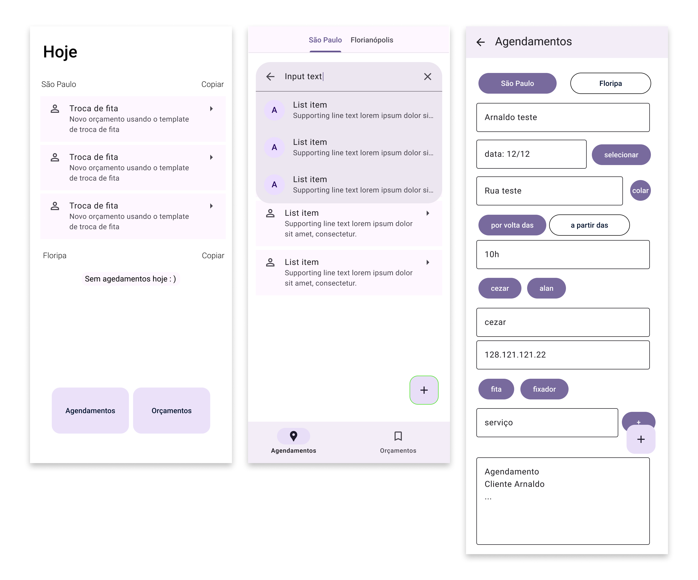

<a id="readme-top"></a>

[![LinkedIn][linkedin-shield]][linkedin-url]


<!-- PROJECT LOGO -->
<br />
<div align="center">
  <a href="https://github.com/lelematos/repo_name">
    
  </a>
<h3 align="center">Criação de Agendamentos - Vex Persianas</h3>
  <p align="center">
    Este projeto tem por objetivo apresentar um pouco do resultado e das tecnologias utilizadas no desenvolvimento da aplicação Mobile destinada a criação e controle de Agendamentos da Vex Persianas.
    <br />
    <br />
  </p>
</div>

<!-- ABOUT THE PROJECT -->
## Sobre o Projeto

A aplicação mobile da Vex foi desenvolvida para atender à necessidade de padronização, facilidade de uso e registro permanente dos agendamentos. Com uma interface simples e intuitiva, a aplicação possui duas páginas principais:

Lista de Agendamentos: Exibe todos os agendamentos com suas respectivas informações, como status, data, e outros detalhes relevantes.

Criação/Edição de Agendamento: Permite a criação ou edição de novos agendamentos de forma rápida e eficiente.

Para garantir a consistência na comunicação com os clientes, a aplicação oferece uma funcionalidade que permite copiar o conteúdo do orçamento formatado de maneira padronizada para envio via WhatsApp. O formato da mensagem é estruturado da seguinte forma:

```json
Cliente: <nome do cliente>

Manutenção agendada para <dia da semana> dia <data DD/MM>, horário de chegada: por volta das <horário de chegada previsto>, conforme combinado.

Endereço:
<endereço do cliente>

Técnico:
<nome do técnico alocado>
CPF: <cpf do técnico>

Serviço:
<serviço 1>
<serviço 2>
<...>
```

Os agendamentos são persistidos em um Realtime Database (Firebase), que é compartilhado com a aplicação desktop, assegurando a sincronização e integridade dos dados em ambas as plataformas.

<p align="right">(<a href="#readme-top">voltar ao topo</a>)</p>


### Ferramentas e Tecnologias Utilizadas

* [![Expo][Expo]][Expo-url]
* [![ReactNative][ReactNative.js]][ReactNative-url]
* [![Firebase][Firebase]][Firebase-url]

<p align="right">(<a href="#readme-top">voltar ao topo</a>)</p>

## Captura de Tela da Página inicial

<div>
    <p>Apresentação geral da aplicação.</p>
    
</div>

<p align="right">(<a href="#readme-top">voltar ao topo</a>)</p>

<!-- MARKDOWN LINKS & IMAGES -->
<!-- https://www.markdownguide.org/basic-syntax/#reference-style-links -->
[linkedin-shield]: https://img.shields.io/badge/-LinkedIn-black.svg?style=for-the-badge&logo=linkedin&colorB=555
[linkedin-url]: https://www.linkedin.com/in/leandro-matos-2275521a3/

[Firebase]: https://img.shields.io/badge/Firebase-ffffff?style=for-the-badge&logo=firebase&logoColor=DD2C00
[Firebase-url]: https://firebase.google.com/?hl=pt

[ReactNative.js]: https://img.shields.io/badge/React%20Native-20232A?style=for-the-badge&logo=react&logoColor=61DAFB
[ReactNative-url]: https://reactnative.dev/

[Expo]: https://img.shields.io/badge/Expo-ffffff?style=for-the-badge&logo=expo&logoColor=000020
[Expo-url]: https://expo.dev/